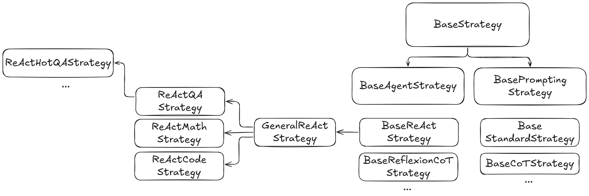

# 🚀 Contributing 

👍🎉 First off, thanks for taking the time to contribute! 🎉👍

Whether it's a bug report, new feature, correction, or additional documentation, we greatly value feedback and contributions from our community.

Please read through this document before submitting any issues or pull requests to ensure we have all the necessary information to effectively respond to your bug report or contribution.

## 1. 💪 Getting Started

### 🍴 Fork the Repository

To start your journey, you'll need your very own copy of agential. Think of it as your innovation lab. 🧪

- Navigate to the agential repository on GitHub.
- In the upper-right corner, click the `Fork` button.


### Create and Switch to a New Branch

Create a new branch for your contribution and make sure to add your name and the purpose of the branch.

```
git checkout -b <your-name>/<branch-purpose>
```

Check the "Developer Setup" below for the developer workflow.

### 👍🎉 Submit a Pull Request (PR)

- Create a Pull Request from your branch to the main repository. Make sure to include a detailed description of your changes and reference any related issues.

### 🤝 Collaborate

- Be responsive to comments and feedback on your PR.
- Make necessary updates as suggested.
- Once your PR is approved, it will be merged into the main repository. 


## 2. 🔨 Developer Setup

First install [anaconda](https://docs.anaconda.com/free/anaconda/install/windows/) and follow the recommended settings. 

```
conda --version
```

Ensure you have `make`. if it's not installed on your computer, Please follow this [article](https://earthly.dev/blog/makefiles-on-windows/).


Use the following command to create a conda environment `agential` with Python version 3.11.5. Any Python version above 3.11 is viable.

```
conda create -n agential python=3.11.5
```

Now activate the environment.

```
conda activate agential
```

Please ensure you are in your virtual environment prior to beginning the next step. The Anaconda Command Prompt should have changed from `(base) C:\Users\<username>>` ---> `(agential) C:\Users\<username>>`. The change from (base) to (agential) indicates that you are now in your virtual environment.

Next, we will install [Poetry](https://python-poetry.org/docs/) using [pipx](https://pipx.pypa.io/stable/docs/).

```
pip install pipx
pipx install poetry
```

Make sure to add poetry to path by adding `C:\Users\<username>\.local\bin` to path in advanced system settings. For other operating systems, the path will be different. Ensure poetry is in the environment variable paths.

To ensure that pipx has been successfully installed, type in the command:

```
pipx --version
``` 

This should output the version if it has been installed properly. Then, to verify the poetry installation, type in the command:

``` 
poetry --version
```
This will output the poetry version and verify the existence of the poetry CLI.

Then clone the repository and enter the agential directory.

``` 
git clone https://github.com/alckasoc/agential/
```

Finally install all of the packages.

```
poetry install
```

### Verifying Environment Installation

To verify your environment is correctly installed, please run the following commands.

```
make lint
```
This command will execute the pre-made `lint` target in the Makefile, which, internally, uses `mypy`, `black`, and `ruff`.

If this command fails to run, check if Poetry has properly installed by running (same as previous section):
```
poetry --version
```

Next, run `auto_lint`. This will execute the pre-made `auto_lint` target in the Makefile which automatically formats your code with `black` and `ruff`.

```
make auto_lint
```

Finally, run this command:

```
make test
```

The `test` command within the Makefile internally runs `pytest` on unit tests located in the `tests` directory. 

### Setting up the `.env`

API keys are kept locally in the `.env` file. At the root directory, create a `.env` file and include your relevant API keys. 

To access the API keys, simply:

```
import os
import dotenv

dotenv.load_dotenv()
api_key = os.getenv("<NAME OF YOUR API KEY>")
```

### Pre-commit Install/Uninstall (Optional)

Pre-commit automatically runs specified checks before each commit to ensure code quality, adherence to best practices, and error prevention. If the checks fail, the commit is rejected until the issues are resolved. 

We have `pre-commit` as a developer-sided code quality checker, but often times you may find it slowing down your development! To uninstall `pre-commit`, run:
```
pre-commit uninstall
```

Then, later, should you choose to use it, run:
```
pre-commit install
```

## 3. 🎹 Onboarding

It's integral to get up to speed on the project before you start contributing! There are 2 focuses in onboarding:
- **Understanding the code**
  - Understand the structure of the library, the purpose of each folder and modules; notice repeating patterns and reference the tree diagrams above
  - Understand the base classes and files as they're integral to the rest of the library
  - Understand core methods in classes that are used and understand how the library is used 
- **Understanding the literature**
    - Read through survey paper(s) to survey the field
    - Read through the core papers of our library
      - Survey: https://arxiv.org/abs/2309.07864
      - Survey: https://arxiv.org/abs/2309.14365
      - Survey: https://arxiv.org/abs/2308.11432
      - Conceptual: https://arxiv.org/abs/2309.02427
      - Methods
        - Prompting
          - Chain-of-Thought: https://arxiv.org/abs/2201.11903
          - Self-Refine: https://arxiv.org/pdf/2303.17651
        - Agentic
          - ReAct: https://arxiv.org/abs/2210.03629
          - Reflexion: https://arxiv.org/abs/2303.11366
          - CRITIC: https://arxiv.org/pdf/2305.11738
          - ExpeL: https://arxiv.org/pdf/2308.10144
          - LATS: https://arxiv.org/abs/2310.04406
          - CLIN: https://arxiv.org/pdf/2310.10134
          - AgentOptimizer: https://arxiv.org/pdf/2402.11359

After this, you're ready to start contributing!

## 4. 🧭 Navigating the Repository

This section is for understanding the repository structure, the individual files and how they relate to each other, and the contracts of certain important classes/methods. 

```
├── agential                        <- Library folder.
├── data/                           <- Data folder with each benchmark containing its data.
│   ├── <benchmark-name>/
│   │   ├── README.md
│   │   └── main.ipynb
│   └── ...
├── docs                            <- Documentation.
├── experiments/                    <- Experiments with each method folder containing scripts, one for each benchmark.
│   ├── <method-name>/
│   │   ├── <benchmark-name>.py
│   │   ├── ...
│   │   └── run.sh
│   └── ...
├── notebooks/                      <- Notebooks to show library usage, one for each agent.
│   └── <method-name>.ipynb
├── reports                         <- Diagrams, figures, images, whiteboards.
└── tests                           <- Unit tests, structure reflects agential.
```
_Figure 1. Overall repository structure._

Besides our library folder `agential`, there are 6 main folders:
- `data`: This folder contains the data for each benchmark. Each benchmark has its own folder, and each folder contains the data for that benchmark.
- `docs`: This folder contains the documentation for the project.
- `experiments`: This folder contains the experiments for each method. Each method has its own folder, and each folder contains the scripts for that method. This folder also contains experiment results saved locally.
- `notebooks`: This folder contains the notebooks for each agent. Each notebook contains the code for that agent.
- `reports`: This folder contains the reports/figures/images for the project.
- `tests`: This folder contains the unit tests for the project.

<br>

```
agential/
├── agents/
│   ├── base/
│   │   ├── modules/
│   │   │   ├── memory.py
│   │   │   └── reflect.py
│   │   ├── agent.py
│   │   ├── output.py
│   │   └── strategies.py
│   │
│   ├── <agentic-method-name>/
│   │   ├── strategies/
│   │   │   ├── base.py
│   │   │   ├── code.py
│   │   │   ├── general.py
│   │   │   ├── math.py
│   │   │   └── qa.py
│   │   ├── agent.py
│   │   ├── functional.py
│   │   ├── output.py
│   │   └── prompts.py
│   └── ...
│
├── core/
│   ├── base/
│   │   ├── method.py
│   │   ├── output.py
│   │   └── strategies.py
│   ├── fewshots/
│   │   └── <benchmark-name>.py
│   └── llm.py
│
├── eval/
│   └── metrics/
│       └── classification.py
│
├── prompting/
│   ├── base/
│   │   ├── output.py
│   │   ├── prompting.py
│   │   └── strategies.py
│   │
│   ├── <prompting-method-name>/
│   │   ├── strategies/
│   │   │   ├── base.py
│   │   │   ├── code.py
│   │   │   ├── general.py
│   │   │   ├── math.py
│   │   │   └── qa.py
│   │   ├── functional.py
│   │   ├── output.py
│   │   ├── prompting.py
│   │   └── prompts.py
│   └── ...
|
├── utils/
│   ├── docstore.py
│   ├── general.py
│   ├── parse.py
│   └── validation.py
└── constants.py
```
_Figure 2. Structure of Agential._

Treat this diagram as a map that you can refer to when you need to understand the structure of the library.
Broadly, the library is divided into 5 main parts:
- `agents`: This folder contains one folder/module for each agent. Each agent has its own folder.
- `core`: This folder contains the core components of the library. This includes the `LLM` and `MockLLM` classes, benchmark-specific few-shot examples, and important base classes.
- `eval`: This folder contains the evaluation metrics used to evaluate the performance of the methods.
- `prompting`: This folder contains one folder/module for each prompting method. 
- `utils`: This folder contains utility functions used throughout the library.

☝️ **Detail**: `agents` and `prompting`, though different, are structured identically. More details on the rest of the library below.

### 3.1 Agent/Prompting

Our library is divided into **prompting** and **agentic** methods. 
Though they have their separate classes, they are identical. 
The below dependency structure diagram applies to all methods under `agential.agents` and `agential.prompting`. At the root, the `agent.py` or `prompting.py` is the main class composing of all other components that constitute an agentic or prompting method. 


_Figure 3. Dependency structure of an agentic or prompting method._

This main class (Agent/Prompting from the above figure) is responsible for retrieving and using the correct ***set of prompts***, ***few-shot examples***, and ***strategy*** for a given *benchmark*. 


_Figure 4. Structure of methods in Agential._

The "Agent/Prompting" module you see in Figure 3 is an agentic/prompting method from Figure 4. 

Because agents and prompting methods are structurally similar, let's take a closer look at `BaseMethod`, their parent class.

```py
class BaseMethod(ABC):
  def __init__(
      self,
      llm: BaseLLM,
      benchmark: str,
      testing: bool = False,
  ) -> None:
    pass

  @abstractmethod
  def get_fewshots(
      self, benchmark: str, fewshot_type: str, **kwargs: Any
  ) -> Dict[str, str]:
    pass

  @abstractmethod
  def get_prompts(self, benchmark: str, **kwargs: Any) -> Dict[str, str]:
    pass

  @abstractmethod
  def get_strategy(self, benchmark: str, **kwargs: Any) -> BaseStrategy:
    pass

  @abstractmethod
  def generate(self, *args: Any, **kwargs: Any) -> BaseOutput:
    pass
```

Above is a simplified version of the `BaseMethod` class. 
It is the main class that is responsible for using the correct ***set of prompts***, ***few-shot examples***, and ***strategy*** for a given *benchmark*. `BaseAgent` and `BasePrompting` inherit from this class and are identical.

The `get_*` methods are indexing into dictionaries of prompts, few-shot examples, and strategies like below.
`get_fewshots` would retrieve from `REACT_BENCHMARK_FEWSHOTS` (benchmark-specific) and `REACT_FEWSHOTS` (method-specific).
`get_prompts` would retrieve from `REACT_PROMPTS` and `get_strategy` would retrieve from `REACT_STRATEGIES`.

```py
REACT_BENCHMARK_FEWSHOTS = {
    Benchmarks.HOTPOTQA: [FewShotType.REACT],
    ...
}

REACT_PROMPTS = {
    Benchmarks.HOTPOTQA: {
        "prompt": REACT_INSTRUCTION_HOTPOTQA,
    },
    ...
}
REACT_FEWSHOTS: Dict[str, Dict] = {
    Benchmarks.HOTPOTQA: {},
    ...
}
REACT_STRATEGIES = {
    Benchmarks.HOTPOTQA: ReActHotQAStrategy,
    ...
}
```

The rest of this section will dismantle the four main methods above:
- **Prompts** (in Figure 3): prompts and few-shot examples; this is where the `get_fewshots` and `get_prompts` methods retrieve from.
- **Strategy** (in Figure 3): the strategy to use for a given benchmark; this covers `get_strategies`.
- **Outputs** (in Figure 3): the output of the agent/prompting method; this is the output of the `generate` method.

Then, we can go through the `generate` method.

### 3.1 Prompts

**📌Note**: In Agential, we distinguish few-shot examples into two categories:
- benchmark-specific
- method-specific


_Figure 5. Structure of prompts and few-shot examples in Agential._

**Benchmark-specific** few-shot examples are few-shot examples you would use for any agent/method for *that* particular benchmark.
**Method-specific** few-shot examples are few-shot examples you would use for *that* particular agent/prompting method on a *particular* benchmark.

Benchmark-specific few-shot examples exist in `agential.core.fewshots`. 
Method-specific few-shot examples exist in `agential.agents.<agent-name>.prompts` or `agential.prompting.<prompting-name>.prompts`.

### 3.2 Strategy


`get_strategy` returns the **strategy**, which encapsulates *all* the agent/prompting logic. 
It may offshore some of this logic to `functional` (functions) or `modules` (modules like `memory.py` or `reflect.py`, etc.).



_Figure 6. Structure of strategies in Agential._

Figure 6 illustrates the family tree of strategies. 
Inheriting from `BaseStrategy`, `BaseAgentStrategy` and `BasePromptingStrategy` are the base classes for agentic and prompting methods, respectively.
These two base classes are then the parents to *method-specific* strategies (like `BaseReActStrategy`).
These method-specific base strategies are the parents to *benchmark-specific, domain-generic* strategies (like `ReActQAStrategy`).
These *benchmark-specific, domain-generic* strategies are the parents to *benchmark-specific, benchmark-specific* strategies (like `ReActHotQAStrategy`).

This structure was motivated by the need to provide complete flexibility (if need be) to implementing the method, while also 
reducing redundant code that may be used across different benchmarks (like QA benchmarks sharing similar functions).
This structure also aims to capture the nuanced details that come with implementing any particular method for any particular benchmark.  

```py
class BaseStrategy(ABC):
  def __init__(
    self,
    llm: BaseLLM,
    testing: bool = False,
  ) -> None:
    self.llm = llm
    self.testing = testing

  @abstractmethod
  def generate(
    self,
    *args: Any,
    **kwargs: Any,
  ) -> Any:
    raise NotImplementedError

  @abstractmethod
  def reset(self, *args: Any, **kwargs: Any) -> None:
    raise NotImplementedError
```

Above is a simplified version of the `BaseStrategy` class. Internally, the agent/prompting class (in Figure 3) will use the strategy's `generate` method when generating the output.

### 3.3 Outputs

The `generate` method returns `BaseOutput`, shown below. This output captures the agent's full trajectory, the final answer, and useful metrics like latency, token usage, and cost.


_Figure 7. Structure of outputs in Agential._

```py
class BaseOutput(BaseModel):
  answer: str = Field(..., description="The answer generated by the method.")
  total_prompt_tokens: int = Field(..., description="Total input tokens used.")
  total_completion_tokens: int = Field(..., description="Total output tokens used.")
  total_tokens: int = Field(..., description="Total tokens used.")
  total_prompt_cost: float = Field(
    ..., description="Total cost of the prompt tokens."
  )
  total_completion_cost: float = Field(
    ..., description="Total cost of the completion tokens."
  )
  total_cost: float = Field(..., description="Total cost of the output.")
  total_prompt_time: float = Field(
    ...,
    description="Total time taken for the LLM API to generate the outputs in seconds.",
  )
  total_time: float = Field(
    ...,
    description="Total time for the method to finish generating in seconds.",
  )
  additional_info: Any = Field(
    ..., description="Additional information related to the output."
  )
```

Above is what the `BaseOutput` class looks like. `BaseAgentOutput` and `BasePromptingOutput` are subclasses of `BaseOutput` for agentic and prompting methods, respectively.

### 3.4 Functional

`functional` is a folder that contains functions that are used across different strategies for a given method. `functional` is more of a module useful for defining method-specific functions that are used across different strategies. It is as flexible as needed. 

### 3.5 Modules [Optional]

`modules` vary from `memory.py` to `reflect.py` to one that may be custom defined. `modules` are used to implement the logic of a specific component of a method that is used across different strategies. It is as flexible as needed and may be needed depending on the method.

### 3.6 Summary

By now, we've covered all the components of `agential.core`:
- `BaseMethod`
- `BaseOutput`
- `BaseStrategy`

We've looked at how these base classes are used in `agential.agents` and `agential.prompting` and the structure of each method, including all relevant modules:
- `agent.py`/`prompting.py`
- `functional.py`
- `<modules>.py`
- `prompts.py`
- `output.py`
- `strategies/`

With this knowledge, you should be able to understand the structure of the library. The next step is to understand the onboarding process and figure out a workflow that works for you.

## 5. ⚒️ What do I work on?

You can start by browsing through our list of [issues](https://github.com/alckasoc/agential/issues) or suggesting your own!

Once you’ve decided on an issue, leave a comment and wait for approval! We don't want multiple people on a single issue unless the issue stresses it! 

If you’re ever in doubt about whether or not a proposed feature aligns with our library, feel free to raise an issue about it and we’ll get back to you promptly!

Since Agential aims to implement as many methods as possible, we're always open to adding more methods and supporting more benchmarks! If you're adding a new benchmark, it may be useful to identify the methods you want to add the benchmark to and familiarizing yourself with the existing code (and strategies). If you're adding a new method, it may be useful to start implementing the logic straight away as a `strategy`, and gradually filter out the components into the other modules.  

## 6. ❓ Questions

Feel free to contact [Vincent Tu](https://www.linkedin.com/in/vincent%2Dtu%2D422b18208/), our lead contributor. We're very friendly and welcoming to new contributors, so don't hesitate to reach out! 🙂

## Thank you for your consideration in joining us 😃🤝🙏
